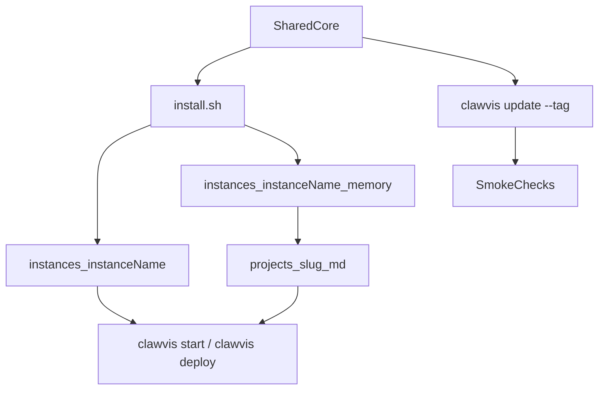

# CLAUDE.md

## Identité Clawvis — Modes historiques

Clawvis assume une identité inspirée de Clovis et des Mérovingiens pour rendre l'onboarding mémorable & amusante, sans sacrifier la clarté UX. Il faut que ce projet vive par la force de son identité, amusante, française et accessible.

Mode:
1) Franc (Recommandé)
   Démarrage rapide. Tout est configuré pour toi. (Nécessite docker)
2) Mérovingien (Avancé)
   Pour un déploiement serveur ou VPS. Ports et chemins configurables.
3) Soissons (contribution)
   Pour contribuer au projet open source Clawvis !

Référence d'identité: https://fr.wikipedia.org/wiki/Clovis_Ier

## Purpose

Clawvis is the shared core platform.
Each real user deployment lives in `instances/<instance_name>/`.

Primary goal:
- keep Clawvis core updatable from upstream
- keep all user-specific behavior inside one instance folder
- Forbidden local edits in root files unless contributing upstream

## Design Philosophy — Adoptability First

**Clawvis must be easy to adopt.** Every friction point in install, onboarding, or UX is a blocker.

- Install = 1 command, no technical knowledge required (mode "Simple" is the default)
- Labels and prompts must use plain language, no Docker/nginx/uv jargon for end users
- Technical options (server deployment, port config, dev stack) exist but are not the default path
- When in doubt, choose the simpler approach for the user-facing layer

## Display/UI Contract — Straightforward & Professional

All user-facing screens (Hub, Settings, Kanban, Logs, install prompts) must follow this display contract:

- **Straightforward first:** clear hierarchy, obvious actions, no decorative noise.
- **Professional tone:** concise labels, neutral copy, no gimmicky wording in core workflows.
- **Dense but readable:** show key information quickly (KPIs, status, filters) without visual clutter.
- **Consistent layout:** same spacing, same card styles, same button behavior across pages.
- **Actionable status:** every status badge/card must help decision-making (connected/not configured, up/down, done/blocked).
- **Predictable controls:** filters and refresh controls stay in stable positions; no jumping UI.
- **No hidden critical info:** primary metrics (system, logs, kanban progress) always visible above the fold.
- **Accessibility baseline:** strong contrast, clear focus states, semantic labels, keyboard-friendly interactions.
- **Production parity:** `hub/src` and `hub/public` should stay visually/functionally aligned (dev/prod same UX).
- **Reference style:** when a visual reference exists in `instances/<instance_name>/public/`, align to it unless explicitly overridden.

### PR UI Must Pass (Checklist)

Before merging a UI change, all 5 points below must be true:

- [ ] **Clarity:** primary action and page purpose are obvious in < 5 seconds.
- [ ] **Critical KPIs visible:** system/logs/kanban top metrics are visible without scrolling.
- [ ] **Stable controls:** filters, refresh, and toggles are aligned and behave predictably.
- [ ] **Copy quality:** labels are short, professional, and free of ambiguous wording.
- [ ] **Dev/Prod parity:** behavior and layout match between `hub/src` and `hub/public`.

## Contexte Hub — alignement référence ldom (récap)

Cette section résume le fil de discussion sur le Hub Vite (`hub/src/`) et l’alignement visuel / UX avec une instance de référence (**ldom** : notamment `instances/ldom/public/kanban/index.html` et démos hub / logs).

**Référence visuelle**
- Priorité : même hiérarchie d’informations et même densité que la référence instance quand elle existe ; le contrat Display/UI ci-dessus prime sur le « décor ».
- Kanban détaillé (colonnes, badges, CoDir, stats) : calqué sur la page Kanban ldom ; cartes compactes (titre, projet, priorité, confiance, effort), pas de description inline sur la carte.

**Kanban (SPA)**
- Barre de stats horizontale type ldom : total, compte par statut, effort restant, % done.
- Comité de direction : carte repliable, barres segmentées par statut, clic sur un projet pour filtrer le board.
- Implémentation principale : `hub/src/main.js` (overview, board, filtres, vues Board/Gantt/Graph, modals) + `hub/src/style.css`.

**Logs (SPA)**
- En-tête de page aligné sur **Settings** (voir ci‑dessous), pas de bandeau mascotte dupliqué.
- Résumé avec pastilles INFO / WARN / ERROR / Total ; filtres niveau + **liste des process** (dérivée des logs), recherche, Refresh (bouton primaire), bascule **Auto: ON/OFF** (persistée `localStorage`).
- Tableau : colonnes Timestamp, Level, Process, Model, Action, Message ; message scindé en ligne principale + méta quand le texte contient ` url=` / `, url=`.

**En-têtes de sous-pages (Logs, Kanban, Brain)**
- Même gabarit que **Settings** : `settings-page-header` — titre `Page · Clawvis` (span accent), sous-titre explicatif, lien retour hub, bouton thème.
- Implémentation : `subpageHeader()` + objet `SUBPAGE_TEXT` (FR/EN via `settingsLocale()`), dans `hub/src/main.js`.
- La **home** conserve le `topbar()` centré (logo, services actifs, raccourcis Logs/Settings, thème).

**Rappels annexes du même chantier**
- Settings : i18n navigateur, health résumé, tooltips ; parité viser `hub/public/settings/index.html` en prod Docker.
- Kanban → mémoire : sync statut vers `.md` quand `source_file` est présent ; test d’intégration `kanban/tests/test_md_sync.py`.
- CI : script skills inclut le skill-tester (`tests/ci-skills.sh`).

## Adoption & Installation — Règles absolues

- **Point d'entrée unique :** `get.sh` (one-liner) ou `./install.sh` — jamais `clawvis install` comme premier contact
- `clawvis install` = raccourci post-install pour re-run le wizard, PAS le bootstrap initial
- `install.sh` gère tout : chmod, symlink `~/.local/bin/clawvis`, injection PATH dans le shell profile, wizard
- Un nouvel utilisateur ne doit jamais taper plus d'une commande pour démarrer
- README : montrer `get.sh` one-liner EN PREMIER, `git clone + ./install.sh` en fallback
- Toute friction dans l'onboarding est un bug, pas un "nice to have"
- `get.sh` clone dans `~/.clawvis` par défaut, surridable via `CLAWVIS_DIR`

## Repository Contract

Two layers must stay separated:

1. Core (shared, upstream-managed)
- `hub/`
- `kanban/`
- `hub-core/`
- `skills/`
- `core-tools/logger/` (standalone Logs UI served at `/logs/`)
- `scripts/`
- root compose and installer files

2. Instance (user-managed)
- `instances/<instance_name>/`
- local overrides, secrets, branding, runtime paths, private routes
- instance memory and instance-specific operational data

## Hub API Contract (Domain-separated)

Clawvis APIs must be **split by domain** under `/api/hub/*` (no cross-domain leakage):

- **`/api/hub/kanban/*`**: Kanban domain (projects/tasks/deps/stats)
- **`/api/hub/memory/*`**: Brain domain (memory tree, Quartz, instance linking, brain rebuild)
- **`/api/hub/logs/*`**: Logs domain (process logs, filters, SSE if needed)
- **`/api/hub/chat/*`**: Chat domain (LLM actions, streaming, etc.)

Rules:
- Brain/Quartz endpoints must **never** live under the Kanban API surface.
- The frontend must call the matching domain prefix (no “/api/hub/kanban/memory/...”, etc.).

### Memory API — quel mode lance quoi

Les **trois modes d’identité** (Franc / Mérovingien / Soissons) ne sont pas trois binaires différents : ce sont des profils d’usage. Le **Hub Memory API** (`hub_core.memory_api`, port **`HUB_MEMORY_API_PORT`**, défaut **8091**) doit tourner dès que le Hub sert Brain/Quartz/settings instances.

| Profil | Chemin typique | Démarrage Memory API |
|--------|----------------|----------------------|
| **Franc** (Docker simple) | `./install.sh` → choix **1) Docker** | `docker compose up … hub-memory-api` avec `hub` / `kanban-api` / Logseq `memory` |
| **Mérovingien** (VPS / déploiement) | `clawvis deploy` → `docker compose up -d --build` sur le serveur | Toute la stack compose, y compris **`hub-memory-api`** |
| **Soissons** (contribution / dev local) | `clawvis start` ou `./install.sh` → **2) Local dev** | `scripts/start.sh` lance **Kanban API** + **Memory API** (uvicorn) + Vite ; `shutdown` libère aussi le port Memory API |

En **Docker**, nginx du conteneur `hub` proxy `/api/hub/memory/` vers le service **`hub-memory-api`**. En **dev**, le proxy Vite (`hub/vite.config.js`) pointe `/api/hub/memory` vers `127.0.0.1:${HUB_MEMORY_API_PORT}`.



## Mandatory Rules (Strict)

DO:
- implement customizations in `instances/<instance_name>/` only
- consume Clawvis updates from versioned releases
- run upgrade checks before redeploy
- keep memory as instance-scoped data

DO NOT:
- patch root core files for instance-specific needs
- store secrets in tracked root files
- tie an instance to `main` if stability matters

## Instance Layout (Target)

Each instance must contain:

- `instances/<instance_name>/docker-compose.override.yml`
- `instances/<instance_name>/.env.local` (gitignored)
- `instances/<instance_name>/memory/`
  - `projects/`
  - `resources/`
  - `daily/`
  - `archive/`
  - `todo/`

Memory rule:
- memory is NOT shared at repo root for runtime ownership
- canonical memory location is instance-scoped
- project pages in memory are the single source of truth

## Single source of truth (markdown in memory)

Authoritative project context and long-form notes live in **Markdown under the instance memory tree**, especially `instances/<instance_name>/memory/projects/<slug>.md`. The Kanban uses the same slug as the project key; when tasks carry a `source_file` (or equivalent binding), updates can be reflected in that `.md` file so **memory stays canonical** relative to the board.

The Hub Brain editor and Kanban memory API intentionally scope edits to **`memory/projects/*.md`** (and list Quartz preview files as **`memory/projects/*.html`** exports). Other folders (`resources/`, `daily/`, etc.) are normal on disk but are not exposed for in-Hub editing unless extended in core.

### Active Brain memory (`hub-core`)

The **on-disk tree** used for the Hub Brain is resolved by **`hub_core.brain_memory.active_brain_memory_root`** (Kanban API wraps it as `active_brain_memory_root(settings)` after loading `hub_settings.json`).

Rules:

- Consider each path in **`linked_instances`**: if `<path>/memory` exists as a directory, it is a candidate.
- If **`MEMORY_ROOT`** (resolved) **equals** one of those candidate memory dirs, that candidate wins.
- Otherwise use the **first** candidate after **sorting** paths lexicographically (e.g. only **ldom** linked → `…/instances/ldom/memory`).
- If **no** linked instance has a `memory/` dir, behavior is unchanged: use **`MEMORY_ROOT`**.

**Several linked instances (recap):** the API picks the instance whose memory directory **equals** `MEMORY_ROOT` first; otherwise the **first** candidate after **sorting** paths. There is **no** separate Hub control yet to pin the Brain source—if needed, a **dedicated field in settings** can be added later.

Kanban uses this root for everything Brain-related: **`list_memory_*`**, read/write **`.md` / `.html`**, **`_memory_file_for`**, **`_ensure_memory_structure`**, and archiving project pages under **`archive/projects/`**. Tasks and **`hub_settings.json`** stay under the runtime **`MEMORY_ROOT`** tree.

**`GET /hub/settings`** includes **`active_brain_memory`**: the resolved path the API uses so the Hub UI (and operators) can see which memory tree is active.

Tests: **`hub-core/tests/test_brain_memory.py`**.

## Install Behavior (Target UX)

`clawvis install` / `clawvis setup` should ask for instance name and create runtime scope from template (pretty prompts from `clawvis-cli/`, then delegates to `install.sh --non-interactive`):

- rename `instances/example/` -> `instances/<instance_name>/`
- initialize memory structure inside that instance
- generate local env and override files
- for `clawvis install` in `MODE=dev`, you can skip primary AI runtime setup (no provider/API-key prompts)
- keep core untouched

If install cannot rename safely, it must stop and explain why.

## Project Source of Truth

When creating a project:
- create memory page in instance memory (`projects/<slug>.md`)
- use that page as the canonical reference for project context
- bind Kanban project key to the same slug

Canonical identity:
- `project_slug == memory_page_slug == kanban_project_key`

## Update Lifecycle (Versioned Releases)

Supported lifecycle:

1. Pin current release
- keep instance running on release tag `vYYYY-MM-dd`

2. Upgrade prep
- fetch next release notes/changelog
- run migration checks for compose/env/memory schemas

3. Apply
- update core to next release tag (or update channel)
- keep `instances/<instance_name>/` unchanged

4. Validate
- smoke test:
  - Hub page loads
  - Brain page loads
  - Logs page loads (even empty)
  - Kanban project view loads and updates
  - project creation writes memory page

5. Promote
- redeploy only after checks pass

## Operational Commands (Expected)

Local dev:
- `clawvis start`
- `clawvis install` / `clawvis setup` (CLI unifié basé sur `clawvis-cli/`)

Deploy:
- `clawvis deploy`

Upgrade (target script to maintain):
- `clawvis update --tag <tag>`

Lifecycle CLI:
- Toute commande doit passer par le CLI unifié (repo `clawvis-cli/`), pas directement par `./install.sh`/scripts du root, afin de garder une UX cohérente.
- `clawvis --help`
- `clawvis update status`
- `clawvis update status --json`
- `clawvis update wizard`
- `clawvis update --channel stable|beta|dev`
- `clawvis backup create`
- `clawvis backup create --json`
- `clawvis restore <backup-id>`
- `clawvis uninstall --dry-run`
- `clawvis uninstall --all --yes`

## CI / Release Contract

Repository automation must stay aligned with lifecycle:

- CI workflow: `.github/workflows/ci.yml`
  - shell syntax checks
  - hub format check, tests, and build
  - Python compile check for Kanban API
- License workflow: `.github/workflows/license.yml`
  - validates MIT license file content
- Release dry-run workflow (PR): `.github/workflows/release-dry-run.yml`
  - validates future release tag format logic
- Release workflow (tag push): `.github/workflows/release.yml`
  - accepts tags matching `vYYYY-MM-dd`
  - publishes GitHub Release notes automatically

## Commit Convention (Mandatory)

Every commit MUST follow this format — no exceptions:

```
<type>(<scope>): <explicit message>
```

**Types** (only these five):
| Type | When |
|------|------|
| `feat` | New feature or capability |
| `fix` | Bug fix |
| `enh` | Enhancement to an existing feature |
| `update` | Non-functional update (deps, config, docs, tooling) |
| `hotfix` | Urgent production fix |

**Scopes** (match the affected area):
`core` · `api` · `cli` · `design` · `test` · `deploy` · `docs` · `install` · `kanban` · `brain` · `hub` · `ci`

**Examples:**
```
feat(hub): add dark mode toggle to settings page
fix(api): correct memory root resolution when multiple instances linked
enh(kanban): improve task card density on mobile
update(docs): add prerequisites table to README
hotfix(install): prevent instance rename when target already exists
feat(test): add install smoke test and fix instances/example template
```

**Rules:**
- Message in English, imperative mood, lowercase after `): `
- No period at the end
- Body optional, separated by blank line
- Hook `.githooks/commit-msg` enforces the format — install with:
  `git config core.hooksPath .githooks`

## Contribution Model

If a change is generic:
- implement in core
- open upstream PR

If a change is instance-specific:
- implement in `instances/<instance_name>/`
- do not modify core behavior

## Repository Visibility

- The GitHub repo **must be public** for `get.sh` (one-liner) to work. A private repo returns 404.
- For private deployments: use `git clone` with SSH keys, or host `get.sh` on your own CDN.
- The README must document this clearly — the one-liner is the front door; it breaks silently if the repo is private.

## Install = Just Launch, No Provider Friction

**The install flow must NOT ask for AI provider/API keys.**

- Install goal: instance name → start Hub → done.
- Provider configuration happens **post-install**, via the Hub UI (`/settings/` → AI Runtime section).
- `install.sh` and the CLI install wizard must skip provider setup entirely for the default "Simple" mode.
- `--skip-primary` is always set when mode = Simple or Dev light.
- Provider setup via CLI: `clawvis setup provider` (future command, post-install).

## Hub UI — AI Runtime Connection

The Hub settings page (`/settings/`) must include an **AI Runtime** section where users can:
- Select their provider (OpenClaw / Claude / Mistral)
- Enter their API key directly in the browser
- Test the connection before saving

Implementation rules:
- Keys saved via the settings UI are stored in the browser's localStorage for frontend-initiated calls.
- A note in the UI must explain that backend/server API key changes require editing `.env` and restarting.
- Provider status (connected / not configured) must be visible on the Hub home page.
- This is the primary adoption surface — it must be polished, zero-friction.

## TODO (Next step)

**Phase 1 — dernier item :**
- [ ] Smoke test services réels : `docker compose up` sur machine propre, vérifier Hub + Kanban répondent

**Phase 2 — priorité :**
- [ ] Connecter Clawvis à l'instance OpenClaw déployée sur Hostinger (guide : `docs/guides/deploy-hostinger.md`)
- [ ] Tester `GET /api/hub/chat/status` → `{"openclaw_configured":true}` depuis le VPS
- [ ] Envoyer un message depuis `/chat/` et recevoir une réponse OpenClaw

**Phase 3 — onboarding :**
- [ ] `clawvis setup provider` — commande CLI post-install pour configurer le provider en terminal
- [ ] README : one-liner `get.sh` en premier, section "Démarrage rapide" avec captures d'écran

@RTK.md

<!-- rtk-instructions v2 -->
# RTK (Rust Token Killer) - Token-Optimized Commands

## Golden Rule

**Always prefix commands with `rtk`**. If RTK has a dedicated filter, it uses it. If not, it passes through unchanged. This means RTK is always safe to use.

**Important**: Even in command chains with `&&`, use `rtk`:
```bash
# ❌ Wrong
git add . && git commit -m "msg" && git push

# ✅ Correct
rtk git add . && rtk git commit -m "msg" && rtk git push
```

## RTK Commands by Workflow

### Build & Compile (80-90% savings)
```bash
rtk cargo build         # Cargo build output
rtk cargo check         # Cargo check output
rtk cargo clippy        # Clippy warnings grouped by file (80%)
rtk tsc                 # TypeScript errors grouped by file/code (83%)
rtk lint                # ESLint/Biome violations grouped (84%)
rtk prettier --check    # Files needing format only (70%)
rtk next build          # Next.js build with route metrics (87%)
```

### Test (90-99% savings)
```bash
rtk cargo test          # Cargo test failures only (90%)
rtk vitest run          # Vitest failures only (99.5%)
rtk playwright test     # Playwright failures only (94%)
rtk test <cmd>          # Generic test wrapper - failures only
```

### Git (59-80% savings)
```bash
rtk git status          # Compact status
rtk git log             # Compact log (works with all git flags)
rtk git diff            # Compact diff (80%)
rtk git show            # Compact show (80%)
rtk git add             # Ultra-compact confirmations (59%)
rtk git commit          # Ultra-compact confirmations (59%)
rtk git push            # Ultra-compact confirmations
rtk git pull            # Ultra-compact confirmations
rtk git branch          # Compact branch list
rtk git fetch           # Compact fetch
rtk git stash           # Compact stash
rtk git worktree        # Compact worktree
```

Note: Git passthrough works for ALL subcommands, even those not explicitly listed.

### GitHub (26-87% savings)
```bash
rtk gh pr view <num>    # Compact PR view (87%)
rtk gh pr checks        # Compact PR checks (79%)
rtk gh run list         # Compact workflow runs (82%)
rtk gh issue list       # Compact issue list (80%)
rtk gh api              # Compact API responses (26%)
```

### JavaScript/TypeScript Tooling (70-90% savings)
```bash
rtk pnpm list           # Compact dependency tree (70%)
rtk pnpm outdated       # Compact outdated packages (80%)
rtk pnpm install        # Compact install output (90%)
rtk npm run <script>    # Compact npm script output
rtk npx <cmd>           # Compact npx command output
rtk prisma              # Prisma without ASCII art (88%)
```

### Files & Search (60-75% savings)
```bash
rtk ls <path>           # Tree format, compact (65%)
rtk read <file>         # Code reading with filtering (60%)
rtk grep <pattern>      # Search grouped by file (75%)
rtk find <pattern>      # Find grouped by directory (70%)
```

### Analysis & Debug (70-90% savings)
```bash
rtk err <cmd>           # Filter errors only from any command
rtk log <file>          # Deduplicated logs with counts
rtk json <file>         # JSON structure without values
rtk deps                # Dependency overview
rtk env                 # Environment variables compact
rtk summary <cmd>       # Smart summary of command output
rtk diff                # Ultra-compact diffs
```

### Infrastructure (85% savings)
```bash
rtk docker ps           # Compact container list
rtk docker images       # Compact image list
rtk docker logs <c>     # Deduplicated logs
rtk kubectl get         # Compact resource list
rtk kubectl logs        # Deduplicated pod logs
```

### Network (65-70% savings)
```bash
rtk curl <url>          # Compact HTTP responses (70%)
rtk wget <url>          # Compact download output (65%)
```

### Meta Commands
```bash
rtk gain                # View token savings statistics
rtk gain --history      # View command history with savings
rtk discover            # Analyze Claude Code sessions for missed RTK usage
rtk proxy <cmd>         # Run command without filtering (for debugging)
rtk init                # Add RTK instructions to CLAUDE.md
rtk init --global       # Add RTK to ~/.claude/CLAUDE.md
```

## Token Savings Overview

| Category | Commands | Typical Savings |
|----------|----------|-----------------|
| Tests | vitest, playwright, cargo test | 90-99% |
| Build | next, tsc, lint, prettier | 70-87% |
| Git | status, log, diff, add, commit | 59-80% |
| GitHub | gh pr, gh run, gh issue | 26-87% |
| Package Managers | pnpm, npm, npx | 70-90% |
| Files | ls, read, grep, find | 60-75% |
| Infrastructure | docker, kubectl | 85% |
| Network | curl, wget | 65-70% |

Overall average: **60-90% token reduction** on common development operations.
<!-- /rtk-instructions -->

## Audit findings (2026-03-24) — technical debt & architecture notes

### Architecture réelle du stack

- **Dev mode** (`clawvis start` / `start.sh`): Vite sur `HUB_PORT` (défaut 8088 ou 64163), proxy Vite `/api/kanban/*` → Kanban API uvicorn sur `KANBAN_API_PORT` (8090). La `system.json` est un fichier statique dans `hub/public/api/` mis à jour par cron via `hub-core`.
- **Docker mode** (`docker compose up hub memory`): nginx sert `hub/dist/` (SPA compilée). **Le Kanban API n'est PAS dans le docker-compose** → tous les appels `/api/kanban/*` échouent en production Docker. **Gap critique à corriger** : ajouter le service `kanban-api` au docker-compose avec proxy nginx.
- **Brain** = Logseq web app (`ghcr.io/logseq/logseq-webapp`) sur `MEMORY_PORT`. La route `/memory/` dans le Hub est un embed iframe.

### Bugs corrigés dans cette session

1. **hub-core pylint E0211** : `setup_runtime.py:21` — `get_providers()` manquait `@staticmethod` → corrigé.
2. **Hub Prettier** : `src/main.js`, `src/style.css`, `vite.config.js` n'étaient pas formatés → corrigé (`yarn --cwd hub format`).
3. **install.sh — `rg` (ripgrep) non-standard** : `migrate_memory_if_needed` utilisait `rg` → remplacé par `find`.
4. **install.sh — Docker sans message utile** : Erreur vague → message d'erreur clair avec lien install + vérification que Docker tourne (`docker info`).
5. **install.sh — Node version** : Aucune vérification avant d'utiliser le CLI Node → guard Node >= 18 ajouté.
6. **install.sh — yarn absent en dev mode** : Pas de fallback → ajout `corepack enable` automatique + message d'erreur clair.
7. **docker-compose.yml — label obsolète** : `app=clawpilot` (ancien nom) → corrigé en `app=clawvis`.
8. **hub/src/main.js — compteur services** : `/openclaw/` (toujours 404) comptabilisé comme service "down" → marqué `optional: true`, exclu du comptage.
9. **hub/src/main.js — i18n FR accents** : `"Parametres"` → `"Paramètres"`, `"A configurer"` → `"À configurer"`, `"liee(s)"` → `"liée(s)"`, `"Echec"` → `"Échec"`, etc.

### Points de friction install non résolus

- **Smoke test services réels** : `docker/test.Dockerfile` valide le bootstrap (12/12) mais mocke `docker compose up`. Il reste à tester que Hub + Kanban répondent vraiment sur leurs ports après `docker compose up` sur machine propre.
- **Quartz Brain build** : `scripts/build-quartz.sh` dépend d'un submodule optionnel. Si absent, le Brain n'affiche rien. Dégradation gracieuse à améliorer.
- **`clawvis setup provider`** : Commande CLI post-install non implémentée. Pour l'instant, configuration via Hub UI Settings uniquement.

### Acquis session 2026-03-26

- `instances/example/` restauré comme template d'install (docker-compose.override.yml + .env.local.example)
- `docker/test.Dockerfile` : smoke test bootstrap Ubuntu, 12/12 assertions
- Convention de commit `feat/fix/enh/update/hotfix(<scope>)` + hook `.githooks/commit-msg`
- `docs/` restructuré : `adr/`, `guides/`, `roadmap/`, `docs/README.md` index
- `docs/adr/0001` (Docker default) + `0002` (instance-scoped memory)
- `.claude/settings.json` commité — permissions Soissons (docker, yarn, uv, clawvis, npm, git)
- CI : fix `playwright.yml` (setup-uv manquant) + mode skip Playwright sur GitHub Actions
- PR #8 mergée sur `main` — CI verte (3x test pass + validate-future-tag pass)

### Règles d'outillage confirmées

- Hub utilise **Yarn Berry 4** (`packageManager: yarn@4.12.0`) — toujours utiliser `yarn --cwd hub` et non `npm`.
- CLI (`clawvis-cli/`) utilise **npm** (package-lock.json) — utiliser `npm ci` / `npm install`.
- Kanban API et hub-core utilisent **uv** (pyproject.toml) — ne jamais utiliser pip directement.
- CI gate : `bash tests/ci-all.sh` — doit retourner 0 avant tout merge.

<!-- gitnexus:start -->
# GitNexus — Code Intelligence

This project is indexed by GitNexus as **clawvis** (2142 symbols, 4570 relationships, 172 execution flows). Use the GitNexus MCP tools to understand code, assess impact, and navigate safely.

> If any GitNexus tool warns the index is stale, run `npx gitnexus analyze` in terminal first.

## Always Do

- **MUST run impact analysis before editing any symbol.** Before modifying a function, class, or method, run `gitnexus_impact({target: "symbolName", direction: "upstream"})` and report the blast radius (direct callers, affected processes, risk level) to the user.
- **MUST run `gitnexus_detect_changes()` before committing** to verify your changes only affect expected symbols and execution flows.
- **MUST warn the user** if impact analysis returns HIGH or CRITICAL risk before proceeding with edits.
- When exploring unfamiliar code, use `gitnexus_query({query: "concept"})` to find execution flows instead of grepping. It returns process-grouped results ranked by relevance.
- When you need full context on a specific symbol — callers, callees, which execution flows it participates in — use `gitnexus_context({name: "symbolName"})`.

## When Debugging

1. `gitnexus_query({query: "<error or symptom>"})` — find execution flows related to the issue
2. `gitnexus_context({name: "<suspect function>"})` — see all callers, callees, and process participation
3. `READ gitnexus://repo/clawvis/process/{processName}` — trace the full execution flow step by step
4. For regressions: `gitnexus_detect_changes({scope: "compare", base_ref: "main"})` — see what your branch changed

## When Refactoring

- **Renaming**: MUST use `gitnexus_rename({symbol_name: "old", new_name: "new", dry_run: true})` first. Review the preview — graph edits are safe, text_search edits need manual review. Then run with `dry_run: false`.
- **Extracting/Splitting**: MUST run `gitnexus_context({name: "target"})` to see all incoming/outgoing refs, then `gitnexus_impact({target: "target", direction: "upstream"})` to find all external callers before moving code.
- After any refactor: run `gitnexus_detect_changes({scope: "all"})` to verify only expected files changed.

## Never Do

- NEVER edit a function, class, or method without first running `gitnexus_impact` on it.
- NEVER ignore HIGH or CRITICAL risk warnings from impact analysis.
- NEVER rename symbols with find-and-replace — use `gitnexus_rename` which understands the call graph.
- NEVER commit changes without running `gitnexus_detect_changes()` to check affected scope.

## Tools Quick Reference

| Tool | When to use | Command |
|------|-------------|---------|
| `query` | Find code by concept | `gitnexus_query({query: "auth validation"})` |
| `context` | 360-degree view of one symbol | `gitnexus_context({name: "validateUser"})` |
| `impact` | Blast radius before editing | `gitnexus_impact({target: "X", direction: "upstream"})` |
| `detect_changes` | Pre-commit scope check | `gitnexus_detect_changes({scope: "staged"})` |
| `rename` | Safe multi-file rename | `gitnexus_rename({symbol_name: "old", new_name: "new", dry_run: true})` |
| `cypher` | Custom graph queries | `gitnexus_cypher({query: "MATCH ..."})` |

## Impact Risk Levels

| Depth | Meaning | Action |
|-------|---------|--------|
| d=1 | WILL BREAK — direct callers/importers | MUST update these |
| d=2 | LIKELY AFFECTED — indirect deps | Should test |
| d=3 | MAY NEED TESTING — transitive | Test if critical path |

## Resources

| Resource | Use for |
|----------|---------|
| `gitnexus://repo/clawvis/context` | Codebase overview, check index freshness |
| `gitnexus://repo/clawvis/clusters` | All functional areas |
| `gitnexus://repo/clawvis/processes` | All execution flows |
| `gitnexus://repo/clawvis/process/{name}` | Step-by-step execution trace |

## Self-Check Before Finishing

Before completing any code modification task, verify:
1. `gitnexus_impact` was run for all modified symbols
2. No HIGH/CRITICAL risk warnings were ignored
3. `gitnexus_detect_changes()` confirms changes match expected scope
4. All d=1 (WILL BREAK) dependents were updated

## Keeping the Index Fresh

After committing code changes, the GitNexus index becomes stale. Re-run analyze to update it:

```bash
npx gitnexus analyze
```

If the index previously included embeddings, preserve them by adding `--embeddings`:

```bash
npx gitnexus analyze --embeddings
```

To check whether embeddings exist, inspect `.gitnexus/meta.json` — the `stats.embeddings` field shows the count (0 means no embeddings). **Running analyze without `--embeddings` will delete any previously generated embeddings.**

> Claude Code users: A PostToolUse hook handles this automatically after `git commit` and `git merge`.

## CLI

| Task | Read this skill file |
|------|---------------------|
| Understand architecture / "How does X work?" | `.claude/skills/gitnexus/gitnexus-exploring/SKILL.md` |
| Blast radius / "What breaks if I change X?" | `.claude/skills/gitnexus/gitnexus-impact-analysis/SKILL.md` |
| Trace bugs / "Why is X failing?" | `.claude/skills/gitnexus/gitnexus-debugging/SKILL.md` |
| Rename / extract / split / refactor | `.claude/skills/gitnexus/gitnexus-refactoring/SKILL.md` |
| Tools, resources, schema reference | `.claude/skills/gitnexus/gitnexus-guide/SKILL.md` |
| Index, status, clean, wiki CLI commands | `.claude/skills/gitnexus/gitnexus-cli/SKILL.md` |

<!-- gitnexus:end -->
