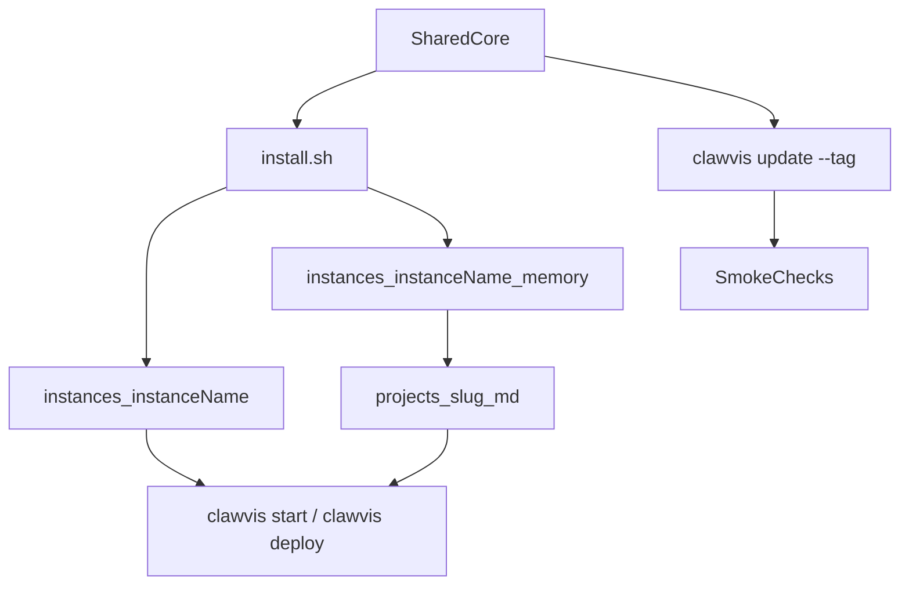

# CLAUDE.md

## Purpose

Clawvis is the shared core platform.
Each real user deployment lives in `instances/<instance_name>/`.

Primary goal:
- keep Clawvis core updatable from upstream
- keep all user-specific behavior inside one instance folder
- Forbidden local edits in root files unless contributing upstream

## Design Philosophy — Adoptability First

**Clawvis must be easy to adopt.** Every friction point in install, onboarding, or UX is a blocker.

- Install = 1 command, no technical knowledge required (mode "Simple" is the default)
- Labels and prompts must use plain language, no Docker/nginx/uv jargon for end users
- Technical options (server deployment, port config, dev stack) exist but are not the default path
- When in doubt, choose the simpler approach for the user-facing layer

## Repository Contract

Two layers must stay separated:

1. Core (shared, upstream-managed)
- `hub/`
- `kanban/`
- `hub-core/`
- `skills/`
- `core-tools/logger/` (standalone Logs UI served at `/logs/`)
- `scripts/`
- root compose and installer files

2. Instance (user-managed)
- `instances/<instance_name>/`
- local overrides, secrets, branding, runtime paths, private routes
- instance memory and instance-specific operational data

## Mandatory Rules (Strict)

DO:
- implement customizations in `instances/<instance_name>/` only
- consume Clawvis updates from versioned releases
- run upgrade checks before redeploy
- keep memory as instance-scoped data

DO NOT:
- patch root core files for instance-specific needs
- store secrets in tracked root files
- tie an instance to `main` if stability matters

## Instance Layout (Target)

Each instance must contain:

- `instances/<instance_name>/docker-compose.override.yml`
- `instances/<instance_name>/.env.local` (gitignored)
- `instances/<instance_name>/memory/`
  - `projects/`
  - `resources/`
  - `daily/`
  - `archive/`
  - `todo/`

Memory rule:
- memory is NOT shared at repo root for runtime ownership
- canonical memory location is instance-scoped
- project pages in memory are the single source of truth

## Install Behavior (Target UX)

`clawvis install` / `clawvis setup` should ask for instance name and create runtime scope from template (pretty prompts from `clawvis-cli/`, then delegates to `install.sh --non-interactive`):

- rename `instances/example/` -> `instances/<instance_name>/`
- initialize memory structure inside that instance
- generate local env and override files
- for `clawvis install` in `MODE=dev`, you can skip primary AI runtime setup (no provider/API-key prompts)
- keep core untouched

If install cannot rename safely, it must stop and explain why.

## Project Source of Truth

When creating a project:
- create memory page in instance memory (`projects/<slug>.md`)
- use that page as the canonical reference for project context
- bind Kanban project key to the same slug

Canonical identity:
- `project_slug == memory_page_slug == kanban_project_key`

## Update Lifecycle (Versioned Releases)

Supported lifecycle:

1. Pin current release
- keep instance running on release tag `vYYYY-MM-dd`

2. Upgrade prep
- fetch next release notes/changelog
- run migration checks for compose/env/memory schemas

3. Apply
- update core to next release tag (or update channel)
- keep `instances/<instance_name>/` unchanged

4. Validate
- smoke test:
  - Hub page loads
  - Brain page loads
  - Logs page loads (even empty)
  - Kanban project view loads and updates
  - project creation writes memory page

5. Promote
- redeploy only after checks pass

## Operational Commands (Expected)

Local dev:
- `clawvis start`
- `clawvis install` / `clawvis setup` (CLI unifié basé sur `clawvis-cli/`)

Deploy:
- `clawvis deploy`

Upgrade (target script to maintain):
- `clawvis update --tag <tag>`

Lifecycle CLI:
- Toute commande doit passer par le CLI unifié (repo `clawvis-cli/`), pas directement par `./install.sh`/scripts du root, afin de garder une UX cohérente.
- `clawvis --help`
- `clawvis update status`
- `clawvis update status --json`
- `clawvis update wizard`
- `clawvis update --channel stable|beta|dev`
- `clawvis backup create`
- `clawvis backup create --json`
- `clawvis restore <backup-id>`
- `clawvis uninstall --dry-run`
- `clawvis uninstall --all --yes`

## CI / Release Contract

Repository automation must stay aligned with lifecycle:

- CI workflow: `.github/workflows/ci.yml`
  - shell syntax checks
  - hub format check, tests, and build
  - Python compile check for Kanban API
- License workflow: `.github/workflows/license.yml`
  - validates MIT license file content
- Release dry-run workflow (PR): `.github/workflows/release-dry-run.yml`
  - validates future release tag format logic
- Release workflow (tag push): `.github/workflows/release.yml`
  - accepts tags matching `vYYYY-MM-dd`
  - publishes GitHub Release notes automatically

## Contribution Model

If a change is generic:
- implement in core
- open upstream PR

If a change is instance-specific:
- implement in `instances/<instance_name>/`
- do not modify core behavior

## TODO (Next step)

- Connect Clawvis to the OpenClaw instance deployed on Hostinger.

