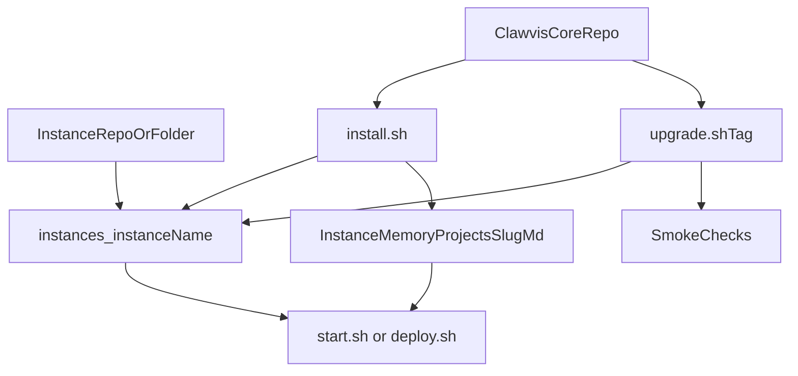

# Contributing to Clawvis

- Open an issue before large changes.
- Keep PRs small and focused.
- Follow the existing code style and structure.
- Update `README.md` and `CHANGELOG.md` when behavior or interfaces change.

## Commit Convention

Every commit must follow:

```
<type>(<scope>): <explicit message>
```

**Types:** `feat` · `fix` · `enh` · `update` · `hotfix`

**Scopes:** `core` · `api` · `cli` · `design` · `test` · `deploy` · `docs` · `install` · `kanban` · `brain` · `hub` · `ci`

**Examples:**
```
feat(hub): add dark mode toggle to settings page
fix(api): correct memory root resolution when multiple instances linked
enh(kanban): improve task card density on mobile
update(docs): add prerequisites table to README
hotfix(install): prevent instance rename when target already exists
```

**Rules:** English, imperative mood, no period at end.

Install the commit-msg hook to enforce this locally:
```bash
git config core.hooksPath .githooks
```

## Clawvis lifecycle model

Clawvis uses a strict two-layer lifecycle:

- **Core layer (shared):** `hub/`, `hub-core/`, `kanban/`, `skills/`, root scripts and compose.
- **Instance layer (user-specific):** `instances/<instance_name>/` for custom behavior and runtime data.

For user/org-specific behavior:
- implement changes in `instances/<instance_name>/` only
- do not patch core files unless the change is generic and intended for upstream contribution

## Install, run, update lifecycle

1. **Install (instance bootstrap)**
- run `./install.sh`
- choose provider (OpenClaw / Claude / Mistral)
- choose instance name (installer renames `instances/example` to `instances/<name>`)
- initialize instance-scoped memory

2. **Run**
- local dev: `./start.sh`
- deploy: `./deploy.sh`
- lifecycle CLI: `clawvis --help`

3. **Upgrade (versioned releases)**
- use `./upgrade.sh <tag>`
- this script checks out a target tag, rebuilds Hub, restarts stack, and runs smoke checks
- or use CLI flow: `clawvis update wizard` / `clawvis update --tag <tag>`



## Memory source of truth

- Memory is instance-scoped (`MEMORY_ROOT`, default `instances/<name>/memory`).
- Project pages in memory are the canonical reference for project context.
- Keep project slug consistent across memory and Kanban linkage.
- Use backups before destructive ops: `clawvis backup create`.

